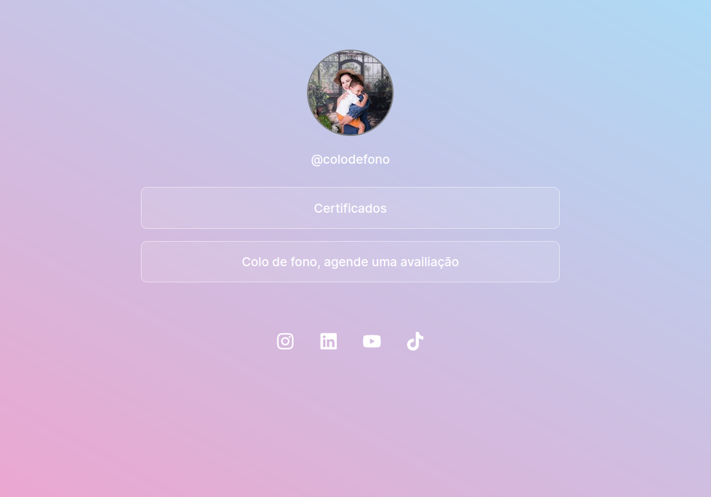

<h1 align="center"> colodefono</h1>

  <a href="#-tecnologias">Tecnologias</a>&nbsp;&nbsp;&nbsp;|&nbsp;&nbsp;&nbsp;
  <a href="#-projeto">Projeto</a>

 

  

## 🚀 Tecnologias

Esse projeto foi desenvolvido com as seguintes tecnologias:

- TypeScript e React
- HTML
- CSS

## 💻 Projeto

O colodefono foi um projeto desenvolvido para a Fonoaudióloga Valéria Moraes. O objetivo do projeto é apresentar os links para as redes sociais dela e seus certificados acadêmicos.

- [Acesse o projeto finalizado, online](http://colodefono.com.br/)

---

Feito com ♥ by Gilberto Moraes, Lybio Moraes Junior e Vinicius Dias

